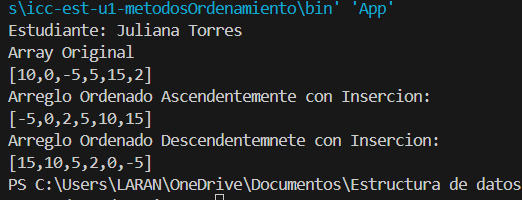
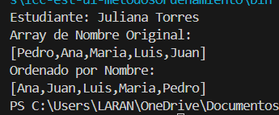
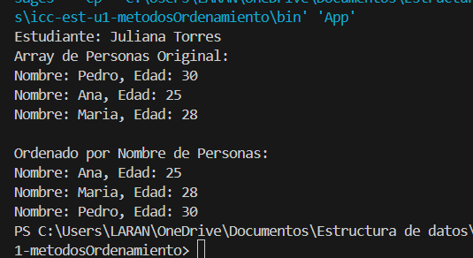
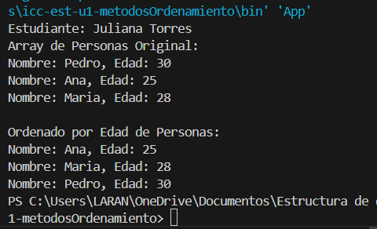

## Estructura de datos

**Estudiante:** Juliana Torres

## Metodos Ordenamiento

### Practica 1 - 20/OCT
Metodo Sort Bubble

### Practica 2 - 21/OCT
Metodo Sort Selecction en Java y Python

Salida de Phyton

Salida de Java

### Practica 3 

Metodo Sort Insertion en Java

1. Arreglo de números enteros

2. Arreglo de cadenas (nombres)

3. Arreglo de personas ordenado por nombre 

4. Arreglo de personas ordenado por edad

